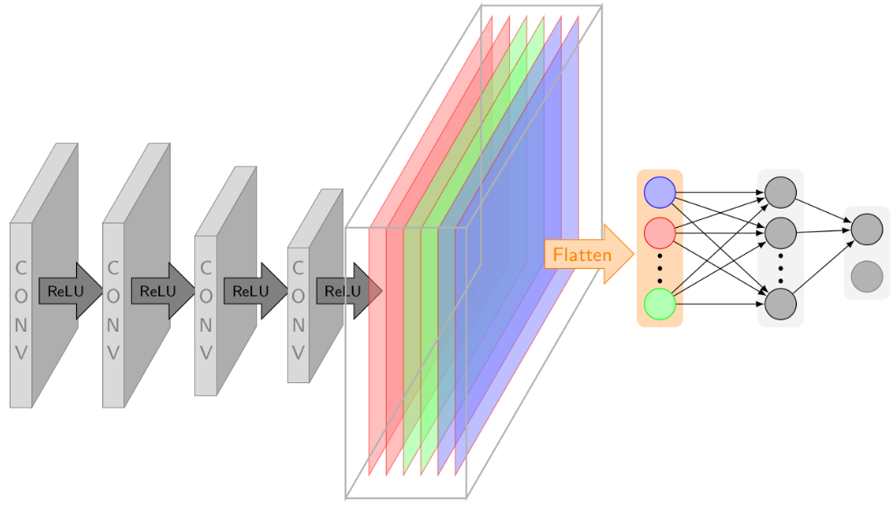
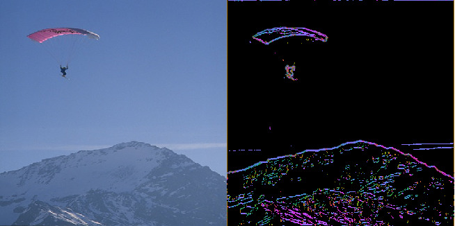

# DeNSE: Deep Network Shearlet Edge Extractor

By H. Andrade-Loarca, G. Kutyniok, O. Öktem, P. Petersen

### License

DeNSE is released under the MIT License (refer to the LICENSE file for details).

### Contents
0. [Introduction](#introduction)
0. [Citation](#citation)
0. [Requirements](#requirements)
0. [Installation](#installation)
0. [Usage](#usage)
0. [References](#references)
0. [Contact](#contact)

### Introduction

This repository contains the entire pipline (including data preprocessing, training, testing, evaluation and visualization) for **DeNSE**.

DeNSE is a recently proposed learning framework towards wavefront set detection in 2D-arrays, in other words, DeNSE computes the edges of an image and its orientations for further applications. This method uses the optimal edge representation in images provided by [Shearlets](/www.shearlab.org) and the highly specilized and accurate classification capabilities of deep convolutional neural networks. For more details, please refere to the [arXiv technical report](https://arxiv.org/abs/1901.01388).

Using a simple 4-layered CNN DeNSE achieves state-of-the-art edge orientation extraction performance on the [Semantic Boundaries Dataset](http://home.bharathh.info/pubs/codes/SBD/download.html) and the [Berkeley Segmentation Dataset](https://www2.eecs.berkeley.edu/Research/Projects/CS/vision/bsds/), as well as other toy dataset with ellipses and parallelograms. It presents also capabilities to detect singularities for different degrees of regularity. 

This method can be used for different applications in image processing and computer vision (e.g. edge/corner detection and tracking) as well as inverse problems regularization (e.g. Wavefront set reconstrucion in Computed Tomography).

### Citation

If you find **SEAL** useful in your research, please consider to cite the following papers:

	@inproceedings{andrade2019dense, 
	  title={Extraction of digital wavefront sets using applied harmonic analysis and deep neural networks}, 
	  author={Andrade-Loarca, Hector, Kutyiniok, Gitta, Öktem, Ozan, Petersen, Philipp},
	  booktitle={arXiv preprint: arXiv:1901.01388}, 
	  year={2019}
	}

### Requirements

### Installation

### Usage

### References

### Contact

[Hector Andrade-Loarca](https://arsenal9971.github.io/)

  Questions can also be left as issues in the repository. We will be happy to answer them.

